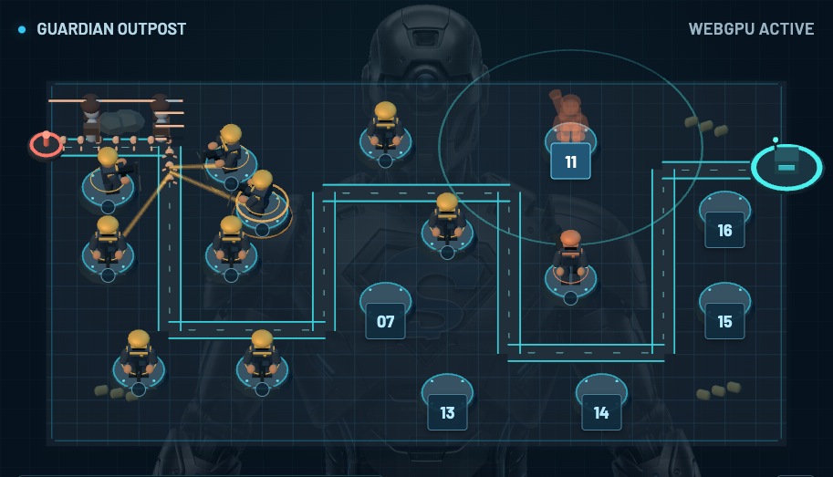
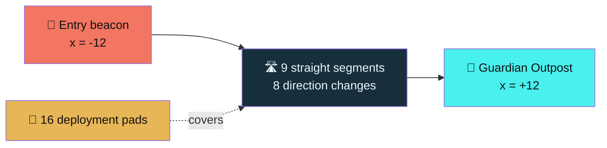
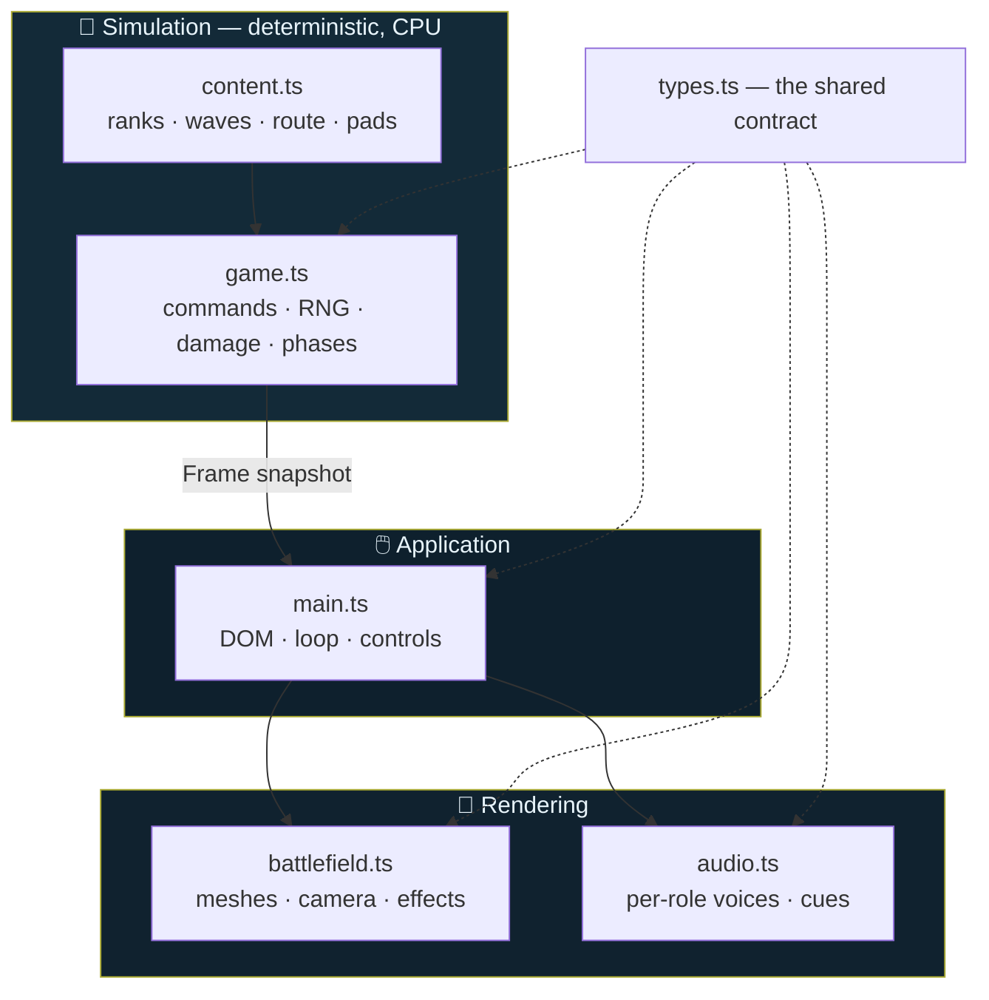
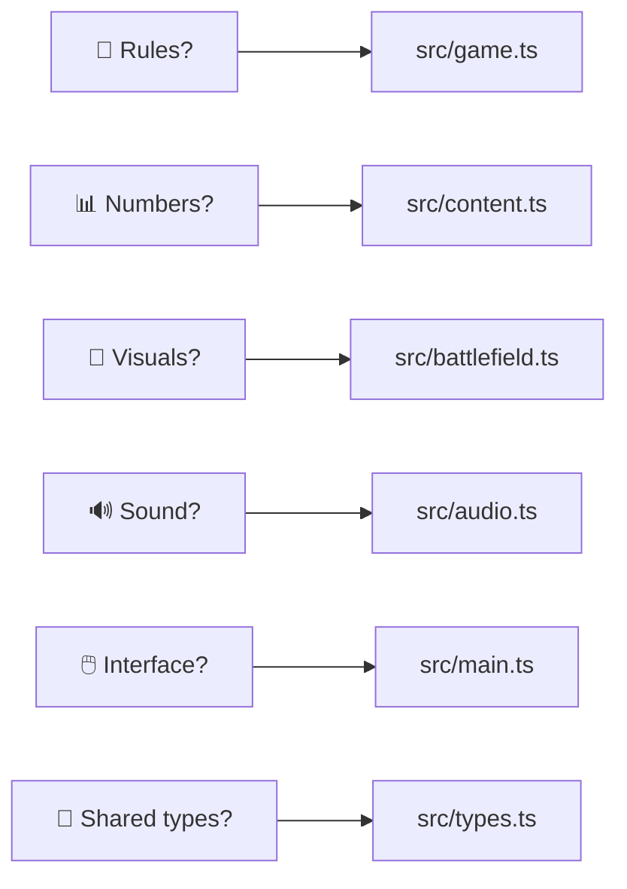

# 🎖️ ShoeMoney Tower Defense

### **Six soldiers. Thirty waves. One outpost.** 🏚️💥

[](LICENSE)
[](#-rendering)
[](#-verify)
[](https://threejs.org/)
[](https://arcade.shoemoney.com/smtd/)

*Operation Iron Dividend* is a free military tower-defense game built for the
[ShoeMoney Arcade](https://arcade.shoemoney.com/). Human soldiers defend Guardian Outpost
while the original ShoeMoney robot watches over the battlefield. 🤖

| 🎮 Play | 🔧 Build | 📚 Understand |
|---|---|---|
| [**Play now**](https://arcade.shoemoney.com/smtd/) | [Quick start](#-quick-start) | [Game design](docs/game-design.md) |
| [How to play](#-how-to-play) | [Verify](#-verify) | [Architecture](docs/architecture.md) |
| [The squad](#-the-squad) | [Contribute](#-contribute) | [Balance data](docs/balance-data.md) |



---

## 🎯 How to play

Pick a soldier, pick a position, hold the line. 🪖

1. 🖱️ **Choose** a soldier from the six squad cards (or press <kbd>1</kbd>–<kbd>6</kbd>).
2. 📍 **Deploy** by selecting a numbered position on the field.
3. 🚀 **Launch** the operation when your formation is ready (<kbd>Space</kbd>).
4. ⏱️ Later waves arrive **automatically** after six-second intermissions.
5. ⬆️ **Select a deployed soldier** to promote it, change its targeting, or recall it for
   70% of the supplies invested.

> 💡 Unaffordable soldiers are gray but still inspectable — hover, focus, or tap any card
> for its full statistics. They regain color as income arrives.

<details>
<summary>⌨️ <b>Full controls reference</b></summary>

| Input | Action |
|---|---|
| <kbd>1</kbd>–<kbd>6</kbd> | Select soldier type |
| <kbd>Space</kbd> | Launch first wave, then pause/resume |
| <kbd>A</kbd> | Call an airstrike |
| <kbd>Esc</kbd> | Clear selection / close dialogs |
| Hover / focus / tap | Inspect a soldier card |

<kbd>Space</kbd> only pauses when a native control does not already own the key. Hidden
tabs pause automatically. Fullscreen retains all game controls. 🖥️

</details>

---

## 🪖 The squad

Six soldiers, each with a base rank and **three** promotions. 🎖️

| # | Soldier | Role | Special |
|---|---|---|---|
| 01 | 🔫 **Cadet** | Affordable pistol | No special effect at any rank |
| 02 | 🎯 **Machine Gunner** | Sustained fire | **Berserker Rage** — 5% per eligible shot for 5× fire rate, five seconds |
| 03 | 🔭 **Sniper** | Boss precision | **Headshot** — 10% per shot; kills normal enemies outright, 5× damage to bosses |
| 04 | 💣 **Grenadier** | Crowd control | Splash damage to everything around the target |
| 05 | 🔧 **Combat Engineer** | Slow the advance | Slows enemies, extending everyone's time on target |
| 06 | 📻 **Field Officer** | Damage support | Local damage aura for nearby soldiers |

> ⚔️ **Plating is the anti-spam rule.** Percentage armor scales with the hit, so it cannot tell sixteen cheap shots from
> four expensive ones. Plating subtracts a flat amount from *every individual hit*, so massed low-rank fire barely
> scratches Armored and Elites while a Sniper round goes almost straight through. Volume is not the answer; damage per
> shot is. A floor of 1 means nothing is ever immune.

⚠️ **Hard rules that never bend:** Rage cannot refresh itself. Bosses resist slowing
(capped at 15%). Officers cannot buff themselves or other Officers. Only the strongest
nearby aura applies.

### 💰 Economy

You start with **$100**; Cadets cost **$10**. Normal monsters pay **$1** on wave one,
increasing by $1 every three waves. A boss with escorts arrives every **fifth** wave.
Survive all **thirty** waves to secure the outpost. 🏆

### ✈️ Airstrikes

Each run has **three**. A strike clears current normal monsters and removes **35%** of each
current boss's maximum health. Strikes need **twelve** simulation seconds to rearm. Future
spawns are unaffected. Press <kbd>A</kbd> or use the Airstrike button.

---

## 👹 The opposition

Seven enemy profiles, each identifiable by **shape alone** — no color required. 🎭

| Enemy | Silhouette cue | Threat |
|---|---|---|
| 🥾 **Scout** | Hip kit pouch | Light infantry; the first test of coverage |
| 🏃 **Runner** | Forward sprint lean, trailing fins | Fast; exposes short coverage |
| 🐝 **Swarm** | Hunched wide crouch, stubby arms | Dense groups that reward splash |
| 🛡️ **Armored** | Broad shoulder blocks | 30% reduction **+ flat 6 plating per hit** |
| ➕ **Medic** | Supply pack with red cross | Heals nearby normal enemies |
| ⚡ **Elite** | Swept crest off the back of the head | Durable *and* fast, 20% reduction **+ flat 8 plating** |
| 🚜 **Commander** | Tracked hull, turret, cannon | Boss. Authored HP, escorts, 10× bounty |

---

## 🗺️ The battlefield



A **24 × 16** map on a horizontal x/z ground plane, bounds `x -12..12`, `z -8..8`. One fixed
serpentine route of nine straight segments, sixteen deployment pads, no maze building.

The camera is orthographic and fits the map **plus a 1.5-unit margin** on every aspect ratio,
so the route's entry beacon and the outpost — which sit exactly on the map boundary — always
clear the frame. On phones the camera rotates to a portrait framing. There is no orbit, pan,
or tactical zoom. 📐

> 🧩 **Deployment pads rest as small studs** and expand into numbered chips on hover, focus,
> or selection — so a deployed soldier is never hidden behind its own label. The 44 px hit
> target never changes size, and the position number stays in the accessible name at all times.

---

## 🏗️ Architecture



**The simulation never depends on rendering.** Time advances in exact 1/60-second ticks.
Each frame copies tower and enemy records so the view cannot mutate combat. Renderers never
consume combat RNG, and graphics timing stays out of combat randomness. 🔒

<details>
<summary>🔊 <b>Audio: six distinct voices from three CC0 recordings</b></summary>

Every role resolves to a different `(clip, rate, filter, volume)` tuple — no two soldiers
sound alike. All shaping is procedural; there are no per-role sample files.

| Soldier | Source clip | Treatment |
|---|---|---|
| Cadet | `pistol-shot.wav` | Unfiltered, baseline pitch |
| Combat Engineer | `pistol-shot.wav` | Pitched down, highpass |
| Field Officer | `pistol-shot.wav` | Pitched up, bandpass + comms blip |
| Machine Gunner | `rifle-shot.wav` | Unfiltered; `gunner-burst.wav` while raging |
| Sniper | `rifle-shot.wav` | Slowed to 0.75, lowpass |
| Grenadier | `rifle-shot.wav` | Deep launcher thump + synthesized detonation layer |

Enemy deaths, boss deaths, boss arrivals and Berserker Rage procs all have their own cues.
Shot sounds are throttled with bounded simultaneous voices, delayed casings, and master
compression. Sound begins **disabled** and needs a user gesture. Visual information must
remain sufficient when muted. 🔇

Bundled firearm recordings are CC0 — see [audio credits](public/audio/CREDITS.md). The
production arcade additionally reuses its own hosted suppressed-shot and casing recordings,
which are **deliberately excluded** from this source package; forks and local builds get a
filtered treatment and a procedural casing fallback instead. See [ASSETS.md](ASSETS.md).

</details>

---

## 🖥️ Rendering

| | |
|---|---|
| **Primary** | Three.js `WebGPURenderer` |
| **Fallback** | WebGL2, selected automatically |
| **Force fallback** | append `?renderer=webgl` |
| **Backend reporting** | the UI displays the *observed* backend, not `navigator.gpu` |

WebGPU requires a secure context — `localhost` counts. GPU device loss pauses play and
presents recovery controls. 🛟

---

## 🚀 Quick start

Requires a current Node.js supported by Vite 8. Built with **Node 26.10.0**; **Node 22.12+**
is the CI baseline.

```sh
npm ci
npm run dev
```

Open the address Vite prints. 🌐

## ✅ Verify

```sh
npm test        # 50 passing, 2 skipped (opt-in benchmark + saved-panel validation)
npm run difficulty                       # when a policy starts bleeding, and which waves do it
npm run difficulty -- splash-control 24  # any policy, any seed count
npm run build   # tsc --noEmit && vite build
npm run preview
```

The static release lands in `dist/`. Relative asset URLs support the `/smtd/` arcade route.
No server or credentials are required to play. The optional arcade scoreboard uses the
same-origin Arcade API only on the production arcade hostname — score submissions are
client-reported and **not** cheat-proof. 🏅

---

## 📚 Read the plan

| Document | What it covers |
|---|---|
| 🎲 [Game design](docs/game-design.md) | Experience, rules, enemies, progression, future work |
| 🏛️ [Architecture](docs/architecture.md) | Ownership, commands, deterministic combat, recovery |
| 📊 [Balance data](docs/balance-data.md) | All 24 rank definitions and 30 authored waves |
| 🧪 [Balance method](docs/balance-method.md) | How the numbers were derived and re-checked |
| 🔬 [Research](docs/research/tower-defense-research.md) | Thirteen primary sources on genre pacing and procs |
| 🎯 [Playtest plan](docs/playtest-plan.md) | Learning, strategy, stress, abuse, readability |
| 📋 [Verification record](docs/verification.md) | Completed checks vs. remaining playtesting |
| 🖼️ [Asset provenance](ASSETS.md) | Original branding and dependency licenses |

> ⚠️ **Honest status:** the numeric balance is a *starting point*. Rules tests and one legal
> campaign completion do **not** establish broad strategic balance or first-time-player
> difficulty. Physical-device and accessibility testing remain open — see the
> [verification record](docs/verification.md).

---

## 🤝 Contribute



- 🧷 Preserve the explicit proc contracts and the four-rank ladders.
- 🧪 Add a focused behavioral test when changing combat rules.
- 🔠 All readable UI and chart text stays at **18 CSS pixels** minimum; body copy and
  controls use **20 px** where practical.
- 🎛️ Use meaningful Font Awesome icons — no decorative arrows, chevrons, or emoji substitutes.
- 👁️ Verify real rendering and touch controls, not just the build. Report the **observed**
  backend.
- 🤖 Keep the original robot faded but visibly present behind the field.

## ⚖️ License

Game code and original procedural geometry are **[MIT licensed](LICENSE)**. 🎉

ShoeMoney brand artwork, the robot identity, the name, the logo and associated trademarks
are **not** covered by that license and no rights to them are granted — forks can swap the
two brand files for their own art without touching combat. See [asset terms](ASSETS.md).

## 🪞 Where this lives

| Host | Repository |
|---|---|
| 🐙 GitHub | [`shoemoney/SMA-smtd`](https://github.com/shoemoney/SMA-smtd) |
| 🍵 Forgejo | [`shoemoney/SMA-smtd`](https://git.shoemoney.ai/shoemoney/SMA-smtd) |

---

<div align="center">

**Hold the line.** 🎖️

*Built for the ShoeMoney Arcade — all game, no quarters.* 🕹️

</div>
